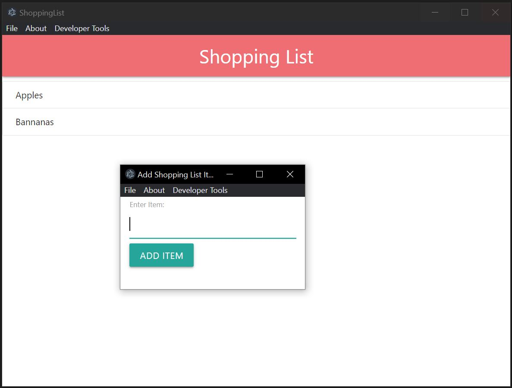

# Electron-ShoppingList

[](https://skillicons.dev)

This is a Desktop App for making shopping lists using Electron framework. Using Javascript, HTML, and CSS.
In Shopping List you can create an entry, and clear the whole list. 

CD into the Directory:

```
cd ShoppingList
```

Install the packages using:
```
npm install
```

Start the Desktop app using:
```
npm start
```

## UI

